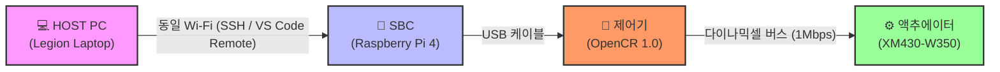

# LV2 Module1 과제 README

## OpenCR 및 ROS2 humble 환경 설정 정보

제공된 장비 사양, 소프트웨어 버전 및 다이나믹셀 모터의 연결 환경 정보입니다.

## 🛠️ 장비 및 개발 환경 안내

| 분류 | 항목 | 세부 사양 / 버전 |
| :--- | :--- | :--- |
| **제어기 (Controller)** | 보드명 | OpenCR 1.0 |
| | 코어 버전 | OpenCR core 1.5.3 |
| **SBC (싱글보드 컴퓨터)** | 하드웨어 | Raspberry Pi 4 |
| | 운영체제 (OS) | Ubuntu Server 22.04.5 LTS |
| | ROS 버전 | ROS2 Humble |
| **호스트 PC (HOST)** | 하드웨어 | Legion Laptop |
| | 운영체제 (OS) | Ubuntu Desktop 22.04.5 LTS |
| | ROS 버전 | ROS2 Humble |
| **개발 도구 (Tools)** | CLI 디바이스 | Arduino CLI 1.5.1 |
| **액추에이터 (Motor)** | 모델명 | XM430-W350 (모델 번호: 1020) |
| | 모터 설정 | ID: 12 / 1Mbps / Protocol 2.0 |

## 🌐 시스템 연결 및 개발 워크플로우

### 📊 시스템 구조도 (Mermaid)

### 📝 상세 연결 및 구동 방식
* **하드웨어 연결:** OpenCR 1.0 제어기와 Raspberry Pi 4(SBC)는 **USB 케이블**로 직접 연결되어 동작합니다.
* **네트워크 구성:** HOST PC(Legion)와 SBC(Raspberry Pi 4)는 **동일한 Wi-Fi 네트워크**에 연결되어 있습니다.
* **원격 개발 환경:** 
  * HOST PC에서 **SSH 클라이언트** 를 통해 SBC에 무선으로 접속합니다.
  * **VS Code Remote Window (SSH Extension)** 를 사용하여 SBC 내부에 저장된 소스 코드를 실시간으로 원격 편집합니다.
  * 실제 ROS2 노드 실행 및 제어 명령은 VS Code의 내장 **원격 터미널(Terminal)** 을 활용하여 제어합니다.

### 📁 결과 파일 경로
* 테스트 및 빌드 결과물은 다음 위치에 저장됩니다: `./results`
